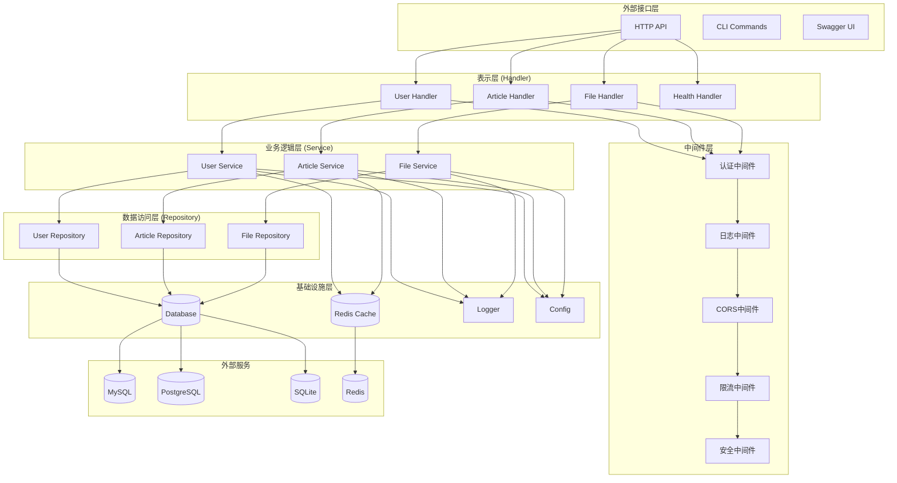
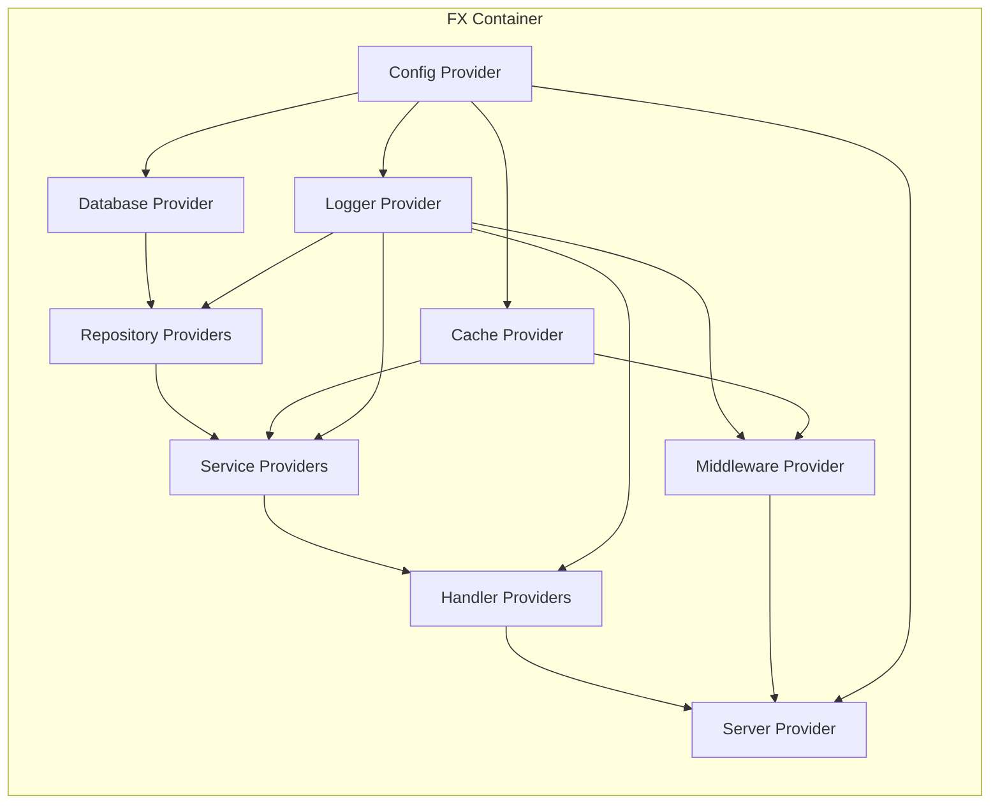
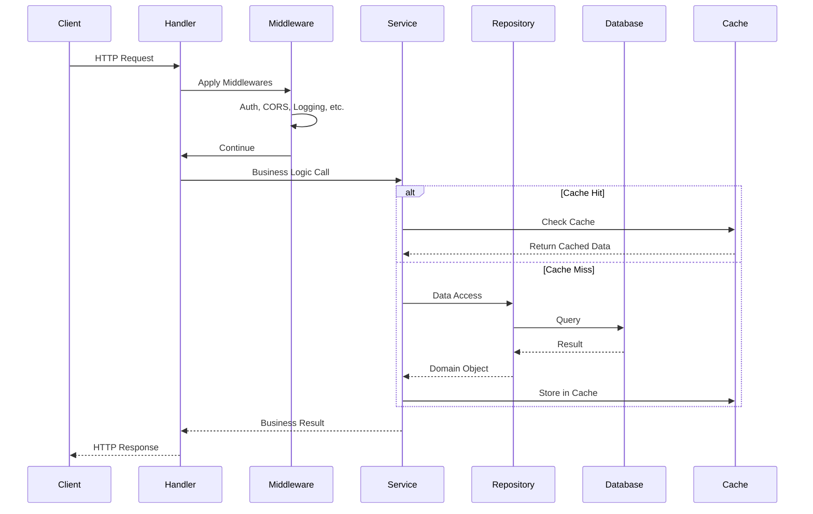
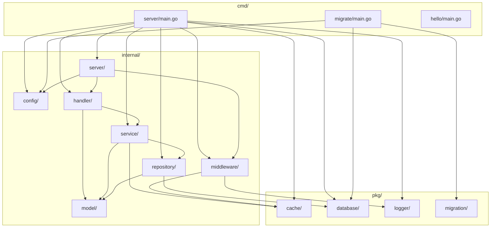
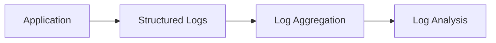
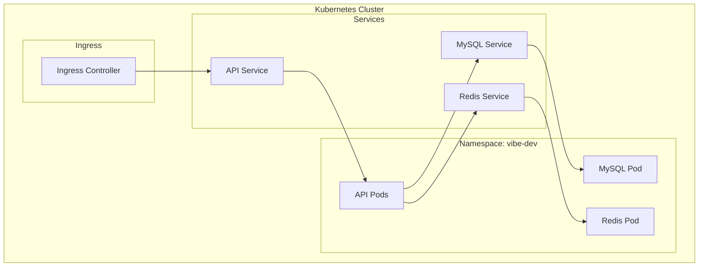

# 项目架构文档

## 系统架构概览

Vibe Coding Starter Go API 采用清洁架构（Clean Architecture）设计模式，确保代码的可测试性、可维护性和可扩展性。

## 架构图



## 依赖注入架构



## 数据流架构



## 模块依赖关系



## 核心组件说明

### 1. 配置管理 (Config)
- **职责**: 统一管理应用配置
- **技术**: Viper
- **特性**: 支持多种配置源（文件、环境变量、命令行）

### 2. 日志系统 (Logger)
- **职责**: 结构化日志记录
- **技术**: Zap
- **特性**: 高性能、结构化、多级别日志

### 3. 数据库抽象 (Database)
- **职责**: 数据库连接和操作抽象
- **技术**: GORM
- **特性**: 支持多种数据库、连接池管理、自动迁移

### 4. 缓存系统 (Cache)
- **职责**: 缓存操作抽象
- **技术**: Redis
- **特性**: 键值存储、过期管理、健康检查

### 5. 中间件系统 (Middleware)
- **职责**: 请求预处理和后处理
- **组件**: 认证、CORS、日志、限流、安全
- **特性**: 可组合、可配置

### 6. 业务层 (Service)
- **职责**: 核心业务逻辑实现
- **特性**: 无状态、可测试、依赖注入

### 7. 数据访问层 (Repository)
- **职责**: 数据持久化操作
- **特性**: 接口抽象、查询构建、事务支持

### 8. 表示层 (Handler)
- **职责**: HTTP 请求处理
- **特性**: 参数验证、响应格式化、错误处理

## 设计原则

### 1. 依赖倒置原则 (DIP)
- 高层模块不依赖低层模块
- 都依赖于抽象接口
- 通过依赖注入实现解耦

### 2. 单一职责原则 (SRP)
- 每个模块只有一个变化的理由
- 清晰的职责边界
- 便于测试和维护

### 3. 开闭原则 (OCP)
- 对扩展开放，对修改关闭
- 通过接口和组合实现扩展
- 插件化架构设计

### 4. 接口隔离原则 (ISP)
- 客户端不应依赖不需要的接口
- 小而专一的接口设计
- 避免接口污染

## 扩展点

### 1. 数据库扩展
```go
// 实现 Database 接口
type NewDatabase struct {
    // 实现细节
}

func (d *NewDatabase) GetDB() *gorm.DB { ... }
func (d *NewDatabase) Health() error { ... }
```

### 2. 缓存扩展
```go
// 实现 Cache 接口
type NewCache struct {
    // 实现细节
}

func (c *NewCache) Set(ctx context.Context, key string, value interface{}, expiration time.Duration) error { ... }
func (c *NewCache) Get(ctx context.Context, key string) (string, error) { ... }
```

### 3. 中间件扩展
```go
// 创建新的中间件
func NewCustomMiddleware() gin.HandlerFunc {
    return func(c *gin.Context) {
        // 中间件逻辑
        c.Next()
    }
}
```

### 4. 服务扩展
```go
// 定义服务接口
type NewService interface {
    DoSomething(ctx context.Context, req *Request) (*Response, error)
}

// 实现服务
type newService struct {
    repo NewRepository
    logger logger.Logger
}
```

## 性能考虑

### 1. 数据库优化
- 连接池配置
- 查询优化
- 索引策略
- 读写分离

### 2. 缓存策略
- 多级缓存
- 缓存预热
- 缓存穿透防护
- 缓存雪崩防护

### 3. 并发处理
- Goroutine 池
- 上下文传递
- 超时控制
- 资源限制

### 4. 内存管理
- 对象池
- 内存复用
- GC 优化
- 内存泄漏防护

## 安全架构

### 1. 认证授权


### 2. 数据安全
- 敏感数据加密
- SQL 注入防护
- 参数验证
- 输出编码

### 3. 网络安全
- HTTPS 强制
- CORS 配置
- 请求限流
- 安全头设置

## 监控和可观测性

### 1. 日志架构


### 2. 指标收集
- 请求指标
- 业务指标
- 系统指标
- 错误指标

### 3. 链路追踪
- 请求追踪
- 依赖分析
- 性能分析
- 错误定位

## 部署架构

### 1. 容器化部署


### 2. 配置管理
- ConfigMap: 应用配置
- Secret: 敏感信息
- Environment Variables: 环境特定配置

### 3. 存储管理
- PersistentVolume: 数据持久化
- Volume Mount: 配置文件挂载

这个架构设计确保了系统的可扩展性、可维护性和高性能，为二次开发提供了坚实的基础。
