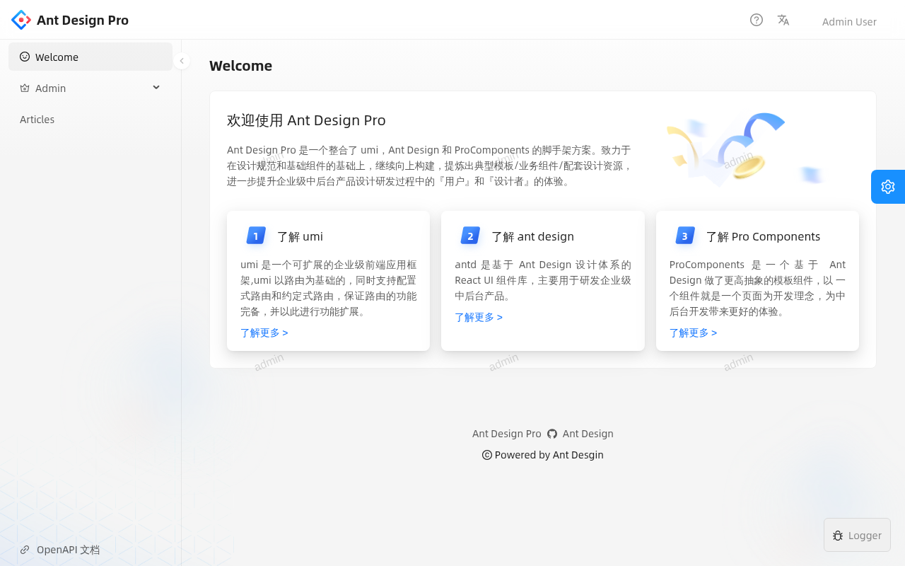
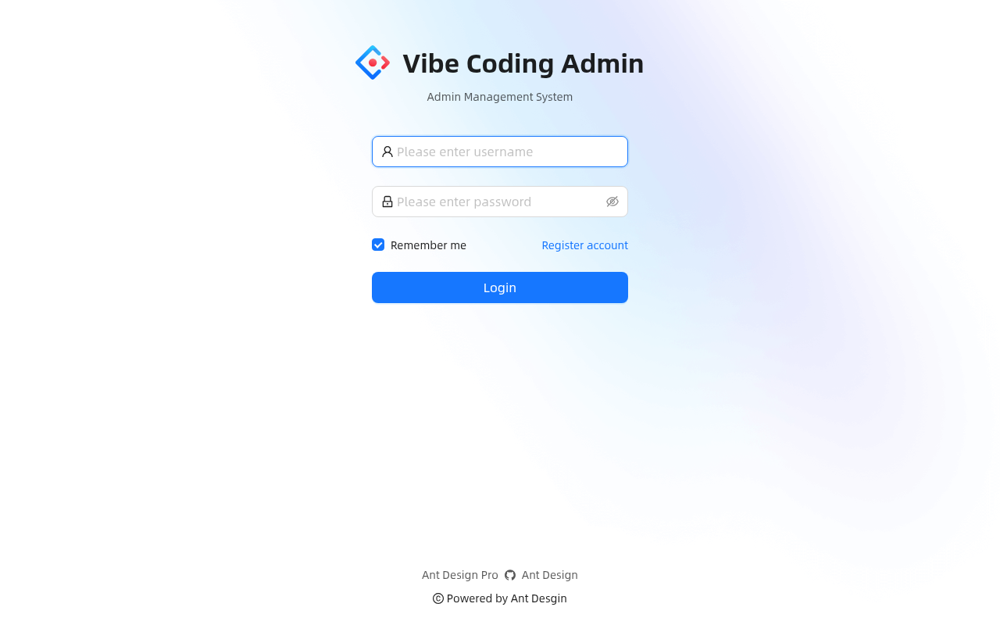
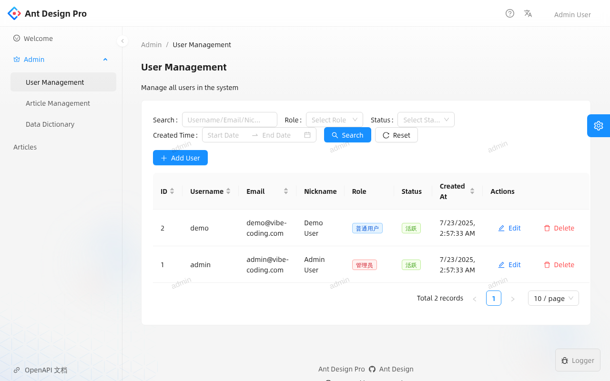
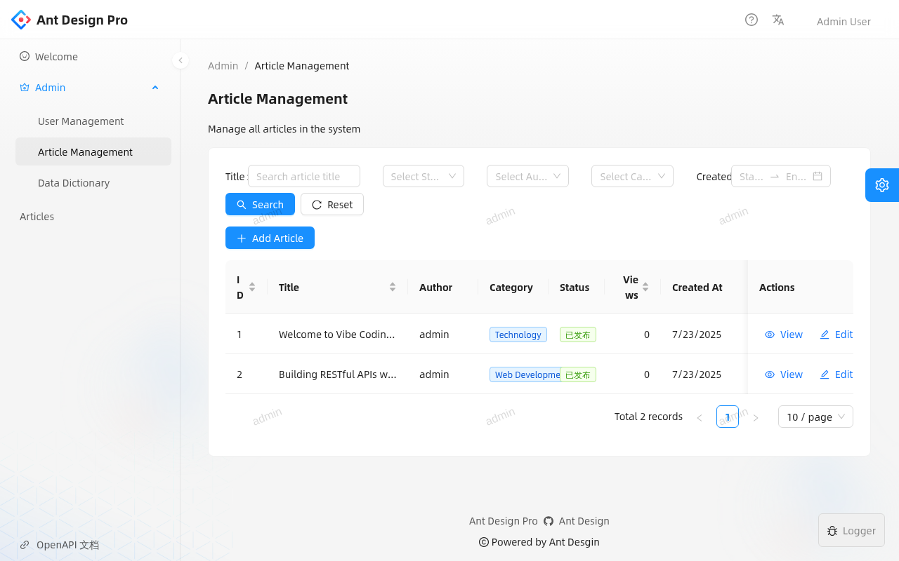
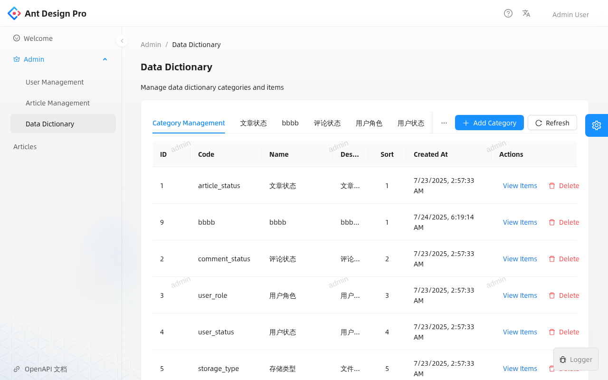
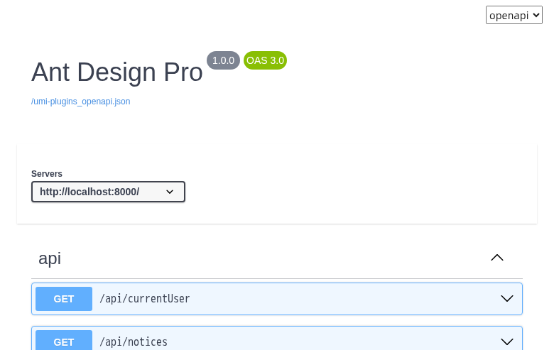

# Vibe Coding Starter Go API

Vibe Coding Starter Go API 是一个 Go 语言的 Web 应用程序模板，集成了 Gin 框架、GORM ORM、Redis、Prometheus 等常用工具，完全由AI工具开发，人工零代码编写，旨在提供一个Vibe Coding快速开发的起点示范工程。即可作为Vibe Coding的学习项目，也可以用来进行二次开发，迭代出生产级业务系统。

## 🚀 快速开始

### 启动后端服务
```bash
cd vibe-coding-starter-go-api
go run cmd/server/main.go -c configs/config-k3d.yaml
```

### 启动前端服务
```bash
cd vibe-coding-starter-antd-ui
npm run dev
```

### 查看前端项目说明
详细的前端项目功能和架构说明请参考：[vibe-coding-starter-antd-ui/README.md](../vibe-coding-starter-antd-ui/README.md)

## 📚 文档导航

### 本地开发环境搭建
- **[开发环境搭建手册](tutorials/develop/README.md)** - 完整的本地开发环境搭建指南
  - [Docker Compose 方式](tutorials/develop/docker-compose/README.md) - 简单快速的开发环境
  - [k3d 方式](tutorials/develop/k3d/README.md) - Kubernetes 开发环境
  - [MySQL 客户端连接指南](tutorials/develop/mysql-client-guide.md) - 数据库连接配置
  - [自动化脚本](tutorials/develop/scripts/README.md) - 一键环境搭建脚本

### 部署文档
- **[K8s 开发环境部署](tutorials/deploy/k8s-dev-manual.md)** - 手动部署到 k3d 开发环境
- **[K8s 部署资源说明](tutorials/deploy/k8s/README.md)** - Kubernetes 资源配置详解

## 🎯 系统功能概览

### 核心功能模块

#### 1. 用户认证与管理
- 用户注册、登录、登出
- 基于 JWT 的身份验证
- 角色权限管理 (RBAC)
- 用户信息管理

#### 2. 文章内容管理
- 文章创建、编辑、删除
- 文章状态管理 (草稿/发布/下线)
- 富文本编辑支持
- 文章列表和搜索

#### 3. 数据字典系统
- 系统配置数据统一管理
- 字典分类和字典项管理
- 动态表单生成
- 缓存机制优化

#### 4. 系统监控
- 健康检查接口
- Prometheus 指标收集
- 应用性能监控
- 日志记录和管理

### 技术特性

#### 后端技术栈
- **框架**: Gin Web Framework
- **ORM**: GORM
- **数据库**: MySQL 8.0 + Redis 7
- **认证**: JWT Token
- **监控**: Prometheus + 健康检查
- **部署**: Docker + Kubernetes

#### 前端技术栈
- **框架**: React 19 + Ant Design Pro 5.x
- **构建**: UmiJS 4.x + TypeScript 5.x
- **测试**: Jest + Playwright
- **部署**: Docker + Kubernetes + Nginx

## 🖼️ 系统截图展示

### 系统欢迎页面
系统首页展示了基于 Ant Design Pro 的现代化管理界面，提供了清晰的导航和功能介绍。



### 用户登录页面
简洁美观的登录界面，支持用户名密码登录，内置记住密码功能。测试账号：admin/vibecoding



### 用户管理模块
完整的用户管理功能，支持用户的增删改查、角色分配、状态管理等操作。提供高级搜索和分页功能。



### 文章管理模块
强大的内容管理系统，支持文章的创建、编辑、发布、分类管理等功能。提供多维度筛选和批量操作。



### 数据字典管理
系统配置数据的统一管理平台，支持字典分类和字典项的动态配置，为系统提供灵活的配置能力。



### 系统API文档
集成的 OpenAPI 文档系统，提供完整的 API 接口文档，支持在线测试和调试功能。



## 🛠️ 开发指南

### 项目结构
```
vibe-coding-starter-go-api/
├── cmd/                    # 应用程序入口
│   └── server/            # 服务器启动程序
├── configs/               # 配置文件
├── internal/              # 内部包
│   ├── api/              # API 路由和处理器
│   ├── model/            # 数据模型
│   ├── service/          # 业务逻辑层
│   └── middleware/       # 中间件
├── pkg/                   # 公共包
├── tutorials/             # 教程文档
└── README.md
```

### 开发环境要求
- Go 1.19+
- MySQL 8.0+
- Redis 7.0+
- Node.js 16+ (前端开发)

### 本地开发流程
1. 按照教程搭建开发环境
2. 启动后端服务：`go run cmd/server/main.go -c configs/config-k3d.yaml`
3. 启动前端服务：`cd ../vibe-coding-starter-antd-ui && npm run dev`
4. 访问 http://localhost:8001 开始开发

### API 接口说明
- 认证接口：`/api/login/*`
- 用户管理：`/api/users/*`
- 文章管理：`/api/articles/*`
- 数据字典：`/api/dict/*`
- 健康检查：`/api/health`

## 🤝 贡献指南

### 代码规范
- 遵循 Go 官方代码规范
- 使用 gofmt 格式化代码
- 编写单元测试
- 提交前运行 `go mod tidy`

### 提交规范
- feat: 新功能
- fix: 修复问题
- docs: 文档更新
- style: 代码格式调整
- refactor: 代码重构
- test: 测试相关
- chore: 构建过程或辅助工具的变动

## 📄 许可证

本项目采用 MIT 许可证 - 查看 [LICENSE](LICENSE) 文件了解详情。

## 🙏 致谢

- [Gin](https://github.com/gin-gonic/gin) - HTTP Web 框架
- [GORM](https://github.com/go-gorm/gorm) - ORM 库
- [Ant Design Pro](https://pro.ant.design/) - 前端框架
- [UmiJS](https://umijs.org/) - 前端构建工具

---

**Vibe Coding Starter** - 让 AI 辅助开发更简单！
